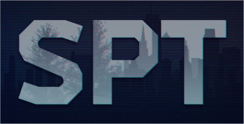

<p align="center"><a href="https://forge.sp-tarkov.com" target="_blank"></a></p>
<h1 align="center"><em>The Forge</em></h1>
<p align="center">
<a href="https://www.mozilla.org/en-US/MPL/2.0/"></a>
<a href="https://github.com/sp-tarkov/forge/actions/workflows/quality.yaml"></a>
<a href="https://github.com/sp-tarkov/forge/actions/workflows/tests.yaml"></a>
<a href="https://discord.com/invite/Xn9msqQZan"></a>
<a href="https://www.patreon.com/sptarkov"></a>
</p>

The Forge is a Laravel-based web application that provides a platform for the Single Player Tarkov community to share and discover user-generated content, such as mods, guides, and other tools. It is currently under heavy development. Please review this entire document before attempting to contribute, especially the "Development Discussion" section.

## Development Environment Setup

We use [Laravel Sail](https://laravel.com/docs/11.x/sail) to mirror the services that are used in our production server in a local development environment. You can see detailed instructions on how to configure the [full development environment](https://dev.sp-tarkov.com/SPT/forge/wiki/Full-Windows-Dev-Env) or a [lightweight development environment](https://dev.sp-tarkov.com/SPT/forge/wiki/Light-Windows-Dev-Env) on the project wiki. The full development environment is recommended.

### Available Services:

| Service     | Access Via Application | Access Via Host  |
|-------------|------------------------|------------------|
| MySQL       | `mysql:3306`           | `localhost:3306` |
| Redis       | `redis:6379`           | `localhost:6379` |
| Meilisearch | `meilisearch:7700`     | `localhost:7700` |
| Mailpit     | `mailpit:1025`         | `localhost:8025` |

### Notable Routes

| Service                          | Authentication | Access Via Host            |
|----------------------------------|----------------|----------------------------|
| Laravel Filament Admin Panel     | Via User Role  | <http://localhost/admin>   |
| Redis Queue Management (Horizon) | Via User Role  | <http://localhost/horizon> |
| Website Status (Pulse)           | Via User Role  | <http://localhost/pulse>   |
| Meilisearch WebUI                | Local Only     | <http://localhost:7700>    |
| Mailpit WebUI                    | Local Only     | <http://localhost:8025>    |

Most of these connection settings should already be configured in the `.env.full` or `.env.light` example files. Simply save one of these (depending on your environment) as `.env` and adjust settings as needed.

### Basic Usage Examples

Here are some basic commands to get started with Forge:

```
# Start the Docker containers in detached mode:
sail up -d
```

```
# View all of the available Artisan commands:
sail artisan
```

```
# Migrate and seed the database with test data:
sail artisan migrate:fresh –seed
```

```
# Run Laravel Horizon (the queue workers/monitor):
sail artisan horizon
```

```
# Sync the local database with the Meilisearch server (requires horizon to be running): 
sail artisan app:search-sync
```

```
# Install NPM dependencies from within the container:
sail npm install
```

```
# Start the development server:
sail npm run dev
```

### More Information

For more information on Laravel development, please refer to the [official documentation](https://laravel.com/docs/11.x/).
