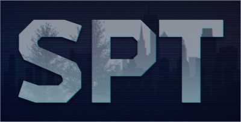

<p align="center"><a href="https://forge.sp-tarkov.com" target="_blank"></a></p>
<h1 align="center"><em>The Forge</em></h1>
<p align="center">
<a href="https://www.mozilla.org/en-US/MPL/2.0/"></a>
<a href="https://github.com/sp-tarkov/forge/actions/workflows/tests.yaml"></a>
<a href="https://discord.com/invite/Xn9msqQZan"></a>
<a href="https://www.patreon.com/sptarkov"></a>
</p>

The Forge is a Laravel-based web application that provides a platform for the Single Player Tarkov community to share and discover user-generated content, such as mods, guides, and other tools. It is currently under heavy development. Please review this entire document before attempting to contribute, especially the "Development Discussion" section.

## Development Environment Setup

We use [Laravel Herd](https://herd.laravel.com) for local development. [Herd Pro](https://herd.laravel.com/pricing) is **recommended** as it includes MySQL, Redis, Meilisearch, and Mailpit out of the box. [Herd Free](https://herd.laravel.com) works for lighter development tasks but lacks these services, so some features (search indexing, queued jobs, etc.) will be limited.

### Prerequisites

- [Laravel Herd](https://herd.laravel.com) (Pro recommended)
- [Composer](https://getcomposer.org) (bundled with Herd)
- [Node.js & npm](https://nodejs.org) (bundled with Herd)

### Getting Started

1. **Clone the repository** and point Herd to the project directory.

2. **Copy the environment file** and generate an application key:
   ```
   # Herd Pro (recommended):
   cp .env.herd-pro .env

   # Herd Free (limited):
   cp .env.herd .env
   ```
   If using `.env.herd`, create the SQLite database file and update `DB_DATABASE` to its absolute path:
   ```
   touch database/database.sqlite
   ```

3. **Install dependencies:**
   ```
   composer install
   npm install
   ```

4. **Generate the application key:**
   ```
   php artisan key:generate
   ```

5. **Start the Herd Pro services** (if using Herd Pro):

   Open Herd and ensure the following services are running:

   | Service     | Purpose                       | Default Port |
   |-------------|-------------------------------|--------------|
   | MySQL       | Database                      | 3306         |
   | Redis       | Cache, sessions, and queues   | 6379         |
   | Meilisearch | Full-text search              | 7700         |
   | Mailpit     | Local email testing           | 8025         |
   | Reverb      | WebSocket broadcasting        | 443          |

   Create a `forge` database in MySQL:
   ```
   mysql -u root -e "CREATE DATABASE IF NOT EXISTS forge"
   ```

6. **Migrate and seed the database:**
   ```
   php artisan migrate:fresh --seed
   ```

7. **Start the dev server:**
   ```
   composer run dev
   ```

   This starts the application server, queue listener, log viewer, and Vite dev server concurrently.

8. **Sync search indexes** (Herd Pro only, requires Horizon running):
   ```
   php artisan horizon
   php artisan app:search-sync
   ```

### Notable Routes

| Service                          | Authentication |
|----------------------------------|----------------|
| Redis Queue Management (Horizon) | Via User Role  |
| Meilisearch WebUI (Herd Pro)     | Local Only     |
| Mailpit WebUI (Herd Pro)         | Local Only     |

### More Information

For more information on Laravel development, please refer to the [official documentation](https://laravel.com/docs/13.x/).
